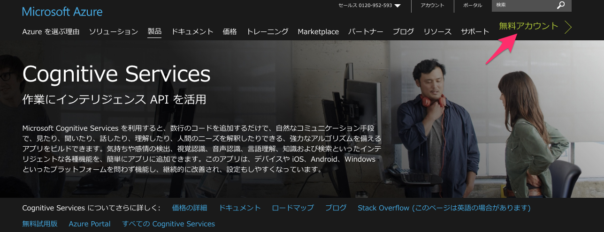
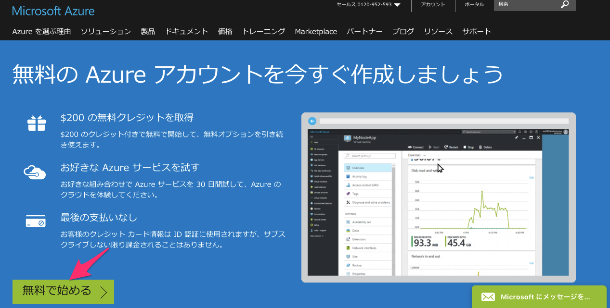
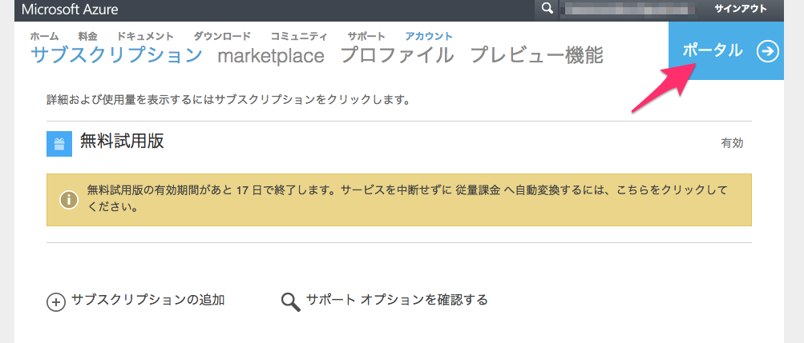
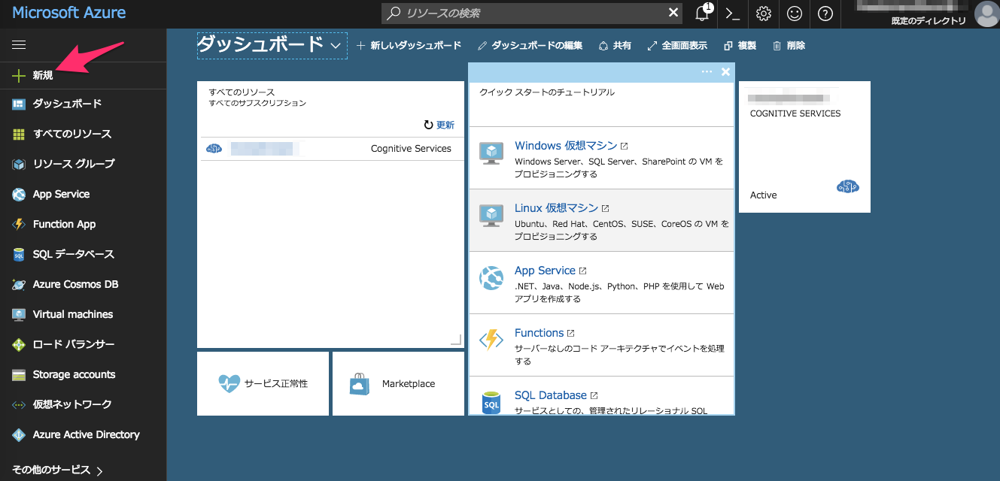
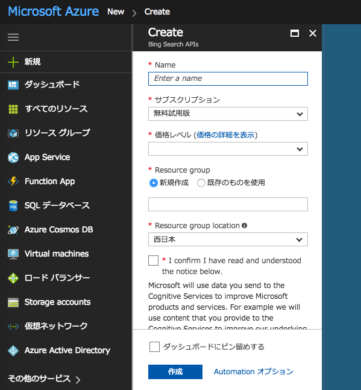
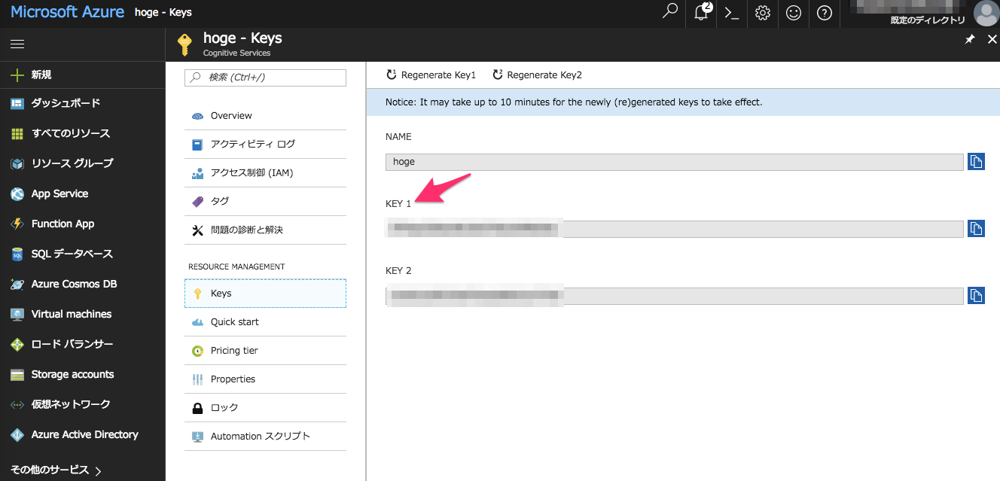

# Bingの画像検索APIを使って機械学習用の画像を収集する


機械学習用の画像を1000枚オーダーで集めたい。というわけで今回はBing(Microsoft)が提供する検索エンジンのAPI 「[Bing Image Search API](https://azure.microsoft.com/ja-jp/services/cognitive-services/bing-image-search-api/)」 を使って画像収集してみます。

## Microsoftアカウントの作成

まず、APIを叩くために必要なAPI Keyを取得するため、Microsoftのカウントを作成します。正直これがめんどくさい。

Microsoftはいろいろなサービスを "Cognitive●●" 系に統一しようとしているようで、これまでのサービスも名前が変わったり、引っ越ししたり、バージョンが変わったりしているようです。2016年7月1日から新しいバージョンのBing Search API v5も公開されているとのことで、ネットでググっても結局どれが現在の（ストレートな）登録の仕方なのかわかりにくくなっています。

いちおう以下の手順は最低限必須だと思われるので試してみてください。（もしかすると他にもアカウントの登録などが必要になるかもです。）

ちなみに、アカウントの作成（Microsoft Azureの登録）にはGoogleのCloud Platformと同じく、無料枠内の利用であってもとりあえずクレジットカード登録が必須となります（無料枠内であればもちろん請求ナシ）。

また、新規登録すると30日間の間だけ使える$200のクーポンが付いてきます。とりあえず遊びで画像収集してみるには十二分に無料で使える感じです。

無料枠以降は、1,000トランザクションごとに$3（1トランザクションで最大50枚画像取得可能）課金が発生するようです（※S1という最低レベルのAPI請求の場合）。値段の詳細は[こちら](https://azure.microsoft.com/ja-jp/pricing/details/cognitive-services/search-api/web/)。googleの画像検索APIである "cutsom search API" の値段と比較してもお安いです。


### 手順

* [Cognitive Service](https://azure.microsoft.com/ja-jp/services/cognitive-services/)のトップページへ行く
* 右上の「無料アカウント」をクリック





左下の「無料で始める」をクリック。言われるがままアカウントを登録する

Microfost Azureのこんなページに降り立つ。



右上の「ポータル」という青いボタンをクリック。

使用するAPIを管理するダッシュボードページへ飛ぶ。



左メニューにある「+ 新規」から新規に利用するAPIを設定できる。

検索ウィンドウで「Bing Search APIs」を検索して結果をクリック。



Createの以下の情報を入れて、confirmにチェックして「作成」。

* Name は任意
* サブスクリプション は登録直後は「無料試用版」しか選択できない模様
* 価格レベル は特にスペック求めないので「S1」にしてみた
* Resource group は「新規作成」、書くところは任意（Nameと同じにしておいたら良さそう）
* Resource group locationは「西日本」or「東日本」

「作成」に成功するとダッシュボードに Nameの名前でパネルが出現するのでそれをクリック

クリックした先の左メニューに「Keys」があるのでクリック



そこに出現する「KEY 1」がAPIを叩くのに必要となるキーとなるのでメモ（たぶん「KEY 2」でもok）


## コード

一応動くコードを置いておきます。（APIを叩くために必要な一番ミニマムなスクリプトは[こちら](https://dev.cognitive.microsoft.com/docs/services/56b43f0ccf5ff8098cef3808/operations/571fab09dbe2d933e891028f)）  
ここでは例として、 『猫』（日本語）という検索ワードでひっかかる画像を1000枚収集してみます。  
Pythonのversionは 3.5.2で、実行は `python3 bing_api.py` するだけです。

実行すると`save_dir_path`で指定したディレクトリ下に`corr_table`、`imgs`、`pickle_files`というディレクトリを作成し、その下に各データを生成します。

```Python
# -*- coding: utf-8 -*-
import http.client
import json
import re
import requests
import os
import math
import pickle
import urllib
import hashlib
import sha3


def make_dir(path):
    if not os.path.isdir(path):
        os.mkdir(path)


def make_correspondence_table(correspondence_table, original_url, hashed_url):
    """Create reference table of hash value and original URL.
    """
    correspondence_table[original_url] = hashed_url


def make_img_path(save_dir_path, url):
    """Hash the image url and create the path

    Args:
        save_dir_path (str): Path to save image dir.
        url (str): An url of image.

    Returns:
        Path of hashed image URL.
    """
    save_img_path = os.path.join(save_dir_path, 'imgs')
    make_dir(save_img_path)

    file_extension = os.path.splitext(url)[-1]
    if file_extension.lower() in ('.jpg', '.jpeg', '.gif', '.png', '.bmp'):
        encoded_url = url.encode('utf-8') # required encoding for hashed
        hashed_url = hashlib.sha3_256(encoded_url).hexdigest()
        full_path = os.path.join(save_img_path, hashed_url + file_extension.lower())

        make_correspondence_table(correspondence_table, url, hashed_url)

        return full_path
    else:
        raise ValueError('Not applicable file extension')


def download_image(url, timeout=10):
    response = requests.get(url, allow_redirects=True, timeout=timeout)
    if response.status_code != 200:
        error = Exception("HTTP status: " + response.status_code)
        raise error

    content_type = response.headers["content-type"]
    if 'image' not in content_type:
        error = Exception("Content-Type: " + content_type)
        raise error

    return response.content


def save_image(filename, image):
    with open(filename, "wb") as fout:
        fout.write(image)


if __name__ == "__main__":
    save_dir_path = '/path/to/save/dir'
    make_dir(save_dir_path)

    num_imgs_required = 1000 # Number of images you want. The number to be divisible by 'num_imgs_per_transaction'
    num_imgs_per_transaction = 150 # default 30, Max 150
    offset_count = math.floor(num_imgs_required / num_imgs_per_transaction)

    url_list = []
    correspondence_table = {}

    headers = {
        # Request headers
        'Content-Type': 'multipart/form-data',
        'Ocp-Apim-Subscription-Key': 'xxxxxxxxxxxxxxxxxxxxxxxxxxx', # API key
    }

    for offset in range(offset_count):

        params = urllib.parse.urlencode({
            # Request parameters
            'q': '猫',
            'mkt': 'ja-JP',
            'count': num_imgs_per_transaction,
            'offset': offset * num_imgs_per_transaction # increment offset by 'num_imgs_per_transaction' (for example 0, 150, 300)
        })

        try:
            conn = http.client.HTTPSConnection('api.cognitive.microsoft.com')
            conn.request("POST", "/bing/v5.0/images/search?%s" % params, "{body}", headers)
            response = conn.getresponse()
            data = response.read()

            save_res_path = os.path.join(save_dir_path, 'pickle_files')
            make_dir(save_res_path)
            with open(os.path.join(save_res_path, '{}.pickle'.format(offset)), mode='wb') as f:
                pickle.dump(data, f)

            conn.close()
        except Exception as err:
            print("[Errno {0}] {1}".format(err.errno, err.strerror))

        else:
            decode_res = data.decode('utf-8')
            data = json.loads(decode_res)

            pattern = r"&r=(http.+)&p=" # extract an URL of image

            for values in data['value']:
                unquoted_url = urllib.parse.unquote(values['contentUrl'])
                img_url = re.search(pattern, unquoted_url)
                if img_url:
                    url_list.append(img_url.group(1))

    for url in url_list:
        try:
            img_path = make_img_path(save_dir_path, url)
            image = download_image(url)
            save_image(img_path, image)
            print('saved image... {}'.format(url))
        except KeyboardInterrupt:
            break
        except Exception as err:
            print("%s" % (err))

    correspondence_table_path = os.path.join(save_dir_path, 'corr_table')
    make_dir(correspondence_table_path)

    with open(os.path.join(correspondence_table_path, 'corr_table.json'), mode='w') as f:
        json.dump(correspondence_table, f)

```


### コードの一部解説

#### パラメータについて

* `headers`の`Ocp-Apim-Subscription-Key`に先程取得したAPI keyを指定
* 検索したいクエリーは `params`中の`q`で指定（日本語も可）
* 取得したい画像枚数は `num_imgs_required` で指定
* 落としてきた画像を保存するpathを `save_dir_path` で指定

1トランザクションで取得する画像数は `params`中の`count`で指定できます（[defaultは35枚で、Maxは150枚](https://msdn.microsoft.com/en-us/library/dn760791.aspx#Anchor_2)）しかし実際には指定した枚数よりも少ない数が返ってくるそうです。  
それ以降の画像を取得する場合は`offset`で指定した数から始まる枚数までスキップして取得が始まります。`offset`は0から始まり、それが`num_imgs_required`で指定した枚数までループされます。具体的にいえば、`count`に150を指定し、全部で450枚画像を引き出そうとした場合、`offset`には 0, 150, 300, 450 とループしながら指定します。（`count`と`offset`の公式解説は[こちら](https://docs.microsoft.com/ja-jp/azure/cognitive-services/bing-web-search/paging-webpages)）

#### 結果ファイルについて

`python3 bing_api.py` を実行すると、`save_dir_path`で指定したディレクトリ下に`corr_table`、`imgs`、`pickle_files`という３つのディレクトリを作成し、その下に各データを生成します。

* **imgs**: APIによって収集した画像が格納されるディレクトリ
* **pickle_files**: APIを叩いて返ってくるレスポンス（jsonデータ）がpickle形式で格納されるディレクトリ。実際に返ってくるjson形式の例は[こちら](https://dev.cognitive.microsoft.com/docs/services/56b43f0ccf5ff8098cef3808/operations/56b4433fcf5ff8098cef380c)。我々が欲しい画像のURLはjson中の 'value' -> 'contentUrl' に格納されているのでそれを取り出しています。
* **corr_table**: 収集した画像の元URLと、それをhash化したファイル名の対応表が辞書形式で格納されているディレクトリ（「画像保存時のファイル名について」を参照）。特に必要ないと思いますが、一応データとして書き出しておきます。

`q`以外の検索パラメータの一覧は[こちら](https://msdn.microsoft.com/en-us/library/dn760791.aspx#Anchor_2)


#### 対象画像種

ここではjpg, jpeg, gif, png, bmpの拡張子を持つ画像のみを取得の対象としています

#### 画像保存時のファイル名について

保存する画像ファイル名は何も考えずに連番でも良かったのですが、機械学習に用いる画像のためできるだけ同一の画像は省きたいところです。

そこで、保存画像名を画像取得時のURLにして重複する名前は勝手に保存時に上書きされるようにしようとしましたが、URLが長すぎるファイルが存在する（ファイル名が長くなる）ために保存時に支障がでるものがありました。

その対策として、画像取得時のURLに対して[hash化処理](http://e-words.jp/w/%E3%83%8F%E3%83%83%E3%82%B7%E3%83%A5%E5%8C%96.html)を行いました。

hash化は元々暗号化のために用いられるものですが、元の文字数に関係なく65文字ほどの文字列に変換してくれる＆同じ内容からは同じ文字列を生成する という特徴があるので、これを利用してファイル名を短くするのと同時に、同内容の画像ファイルは重複として上書きできます。  
pythonのhash化にはhashlibを用い、hash化アルゴリズムのsha3については[こちらのブログ](http://mitakadai.me/archives/220)を参照しました。

hash化例:   
http://hogehogehogehoge~~~/cat.jpg（長いURL）-> hash化 -> 65桁ほどの記号列①を生成  
http://fugafugafugafuga~~~/cat2.jpg（長いURL）-> hash化 -> 65桁ほどの記号列②を生成  
http://hogehogehogehoge~~~/cat.jpg（長いURL）-> hash化 -> ①と同じ65桁ほどの記号列を生成


## 結果と所感

上記の通り、『猫』というキーワードで1000枚画像を取得するためAPIを叩くと、結果として824枚の猫画像を取得することができました。  
1000枚に少し届いていませんが、取得対象の画像拡張子を限定していることと、重複画像が省かれていることを考えると妥当なロスかと思います。

ただし、見方を変えると、『猫』というインターネットに最も溢れかえっているであろう画像であっても800枚程度しか取得できないということでもあります（その後、試しに2000枚を指定して実行しても同じく800枚程度しか取得できないことを確認）

なので、「猫の画像3000枚ほしい」となっても実際にはAPIを叩いて集めるのはなかなか難しそうです。『猫 エジプト』のようにキーワードの組み合わせでもう少し取れそうな気もしますが、それでもそこまで多くはならなそうです。

また、自分はもう少しニッチな、ネット上に画像があまり無さそうな単語を検索して画像を取得したかったのですが、ニッチな検索単語の場合、bingよりもgoogleでの検索結果のほうが目標とする画像が多く存在するように見えました（気の所為かもしれませんが...）。  
やはり検索エンジンによって取得できる画像種と量は違うのかもしれません。

試しに、次はgoogleの「[Custom Search API](https://developers.google.com/custom-search/json-api/v1/overview)」も試してみて、その結果をまとめます。


## 参考
* [Bing Image Search API](http://www.atmarkit.co.jp/ait/articles/1705/30/news035.html)
* [Bing Search API v2 から v5 へ移行した話](http://techblog.adish.co.jp/entry/2016/12/03/Bing_Search_API_v2_%E3%81%8B%E3%82%89_v5_%E3%81%B8%E7%A7%BB%E8%A1%8C%E3%81%97%E3%81%9F%E8%A9%B1) （非常に参考になりました！）