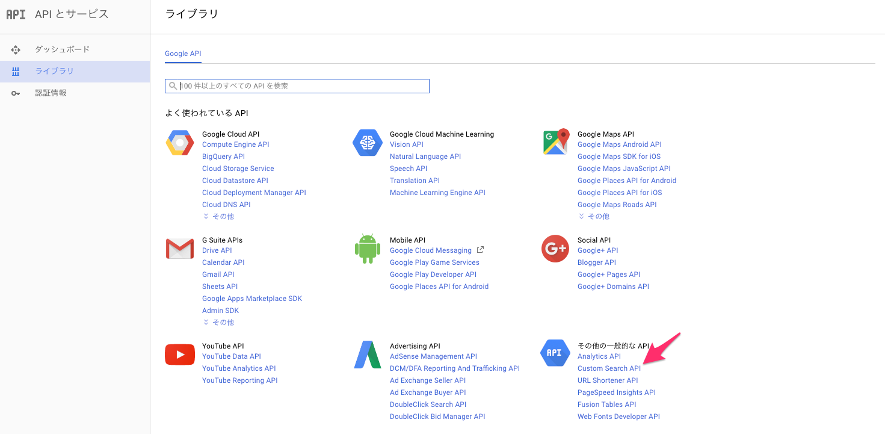
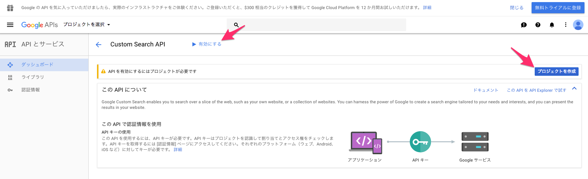
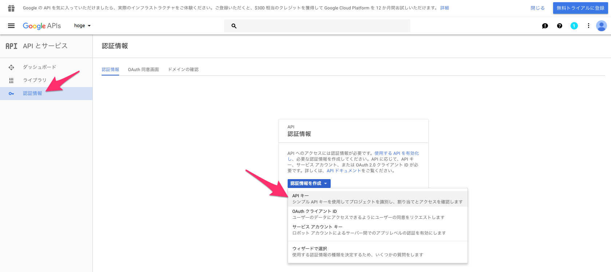

# Googleの画像検索APIを使って機械学習用の画像を収集する

機械学習用の画像を1000枚オーダーで集めたい。

前回は[Bingの画像検索APIを使ってみました](https://qiita.com/ysdyt/items/49e99416079546b65dfc)が、ニッチな検索キーワードで取得できる画像はGoogleの方が多そう（？）な気がしたので、いちおうGoogleでもAPIを叩けるようにしてみました。

というわけで今回はGoogleが提供する検索エンジンのAPI「[Google Custom Search API](https://developers.google.com/custom-search/json-api/v1/overview)」 を使って画像収集してみます。使用言語はPython3です。

Google Custom Search APIは[こちら](https://developers.google.com/custom-search/json-api/v1/reference/cse/list)でデモ実行できます。（※ "cx"パラメータに、後述する「カスタム検索エンジンID」が必要になります）


一番最初にオチを書いてしまいますが、google APIで画像を収集するのはかなりイケてません。BingのAPIを使ったほうがずっとマシな感じです（詳細は後述）。

## APIを叩いて画像取得するまでの流れ
1. Google Developers Console からAPIキーを取得
2. 「カスタム検索エンジン」を作成しkeyを取得
3. google-custom-search-api-pythonをインストール
4. コードを書いてAPIを叩く

という流れです。（実際は1,2,3の順番はどうでも良い）

### 1. Google Developers Console からAPIキーを取得 

Googleのカウントを持っている前提で、[Google Developer Console](https://console.developers.google.com/apis/library)にアクセスします。



「その他の一般的なAPI」にある「Custom Search API」を選択



右側にある「プロジェクトを作成」で、適当な名前を指定してプロジェクトを作成する。  
ついでに「有効にする」もクリックして、Custom Search APIを有効化する。



その後、左メニューにある「認証情報」をクリックして、「認証情報を作成」>「APIキー」を選択
出てきたキーがこれから必要になるAPI keyになるのでメモ。

※不要かもしれませんが、右上の「無料トライアルに登録」が必要そうであれば適宜登録してみてください（←詳しい操作忘れましたorz）

### 2. 「カスタム検索エンジン」を作成しIDを取得

Googleの Custom Search APIを動かすためには、上記のAPI keyだけでなく「カスタム検索エンジン」なるものを作成しそのIDも必要になります。

[こちら](https://cse.google.com/cse/)にアクセスし、IDを作成してください。

詳しい作り方は以下のブログがわかりやすいので参照

- [Google Custom Search API(カスタムサーチAPI)を使ってプログラム的に検索結果を取得する方法](https://urashita.com/archives/8158)

「検索エンジンID」が取得できればokです。


### 3. google-custom-search-api-pythonをインストール

今回はAPIをPythonで動かすため、[公式のPythonモジュール](https://developers.google.com/api-client-library/python/apis/customsearch/v1#system-requirements) をインストールして使います。
自分でスクラッチから面倒なコードをしこしこ書かなくても、簡単にAPIを叩ける便利な関数を利用できるようになります。コマンド一発でインストールできます。

```bash
$ pip install --upgrade google-api-python-client
```

これでAPIを動かすための準備は全部OK

### 4. コードを書いてAPIを叩く

動くコードを置いておきます。（本当にミニマムで動かしたい場合は、[こちら](https://github.com/caiogranero/google-custom-search-api-python)の "The Code" というところを参照してください）

ここでは例として、 『猫』（日本語）という検索ワードでひっかかる画像を1000枚収集してみます。  
Pythonのversionは 3.5.2で、実行は以下

```bash
$ python3 google_api.py
```

実行すると`save_dir_path`で指定したディレクトリ下に`corr_table`、`imgs`、`pickle_files`というディレクトリを作成し、その下に各データを生成します。

```Python:google_api.py
#-*- coding:utf-8 -*-
import urllib.request
import httplib2
import json
import os
import pickle
import hashlib
import sha3

from googleapiclient.discovery import build


def make_dir(path):
    if not os.path.isdir(path):
        os.mkdir(path)


def make_correspondence_table(correspondence_table, original_url, hashed_url):
    correspondence_table[original_url] = hashed_url


def getImageUrl(api_key, cse_key, search_word, page_limit, save_dir_path):

    service = build("customsearch", "v1", developerKey=api_key)
    page_limit = page_limit
    startIndex = 1
    response = []

    img_list = []

    make_dir(save_dir_path)
    save_res_path = os.path.join(save_dir_path, 'api_response_file')
    make_dir(save_res_path)

    for nPage in range(0, page_limit):
        print("Reading page number:", nPage + 1)

        try:
            response.append(service.cse().list(
                q=search_word,     # Search words
                cx=cse_key,        # custom search engine key
                lr='lang_ja',      # Search language
                num=10,            # Number of images obtained by one request (Max 10)
                start=startIndex,
                searchType='image' # search for images
            ).execute())

            startIndex = response[nPage].get("queries").get("nextPage")[0].get("startIndex")

        except Exception as e:
            print(e)

    with open(os.path.join(save_res_path, 'api_response.pickle'), mode='wb') as f:
        pickle.dump(response, f)

    for one_res in range(len(response)):
        if len(response[one_res]['items']) > 0:
            for i in range(len(response[one_res]['items'])):
                img_list.append(response[one_res]['items'][i]['link'])

    return img_list


def getImage(save_dir_path, img_list):
    make_dir(save_dir_path)
    save_img_path = os.path.join(save_dir_path, 'imgs')
    make_dir(save_img_path)

    opener = urllib.request.build_opener()
    http = httplib2.Http(".cache")

    for i in range(len(img_list)):
        try:
            url = img_list[i]
            extension = os.path.splitext(img_list[i])[-1]
            if extension.lower() in ('.jpg', '.jpeg', '.gif', '.png', '.bmp'):
                encoded_url = url.encode('utf-8')  # required encoding for hashed
                hashed_url = hashlib.sha3_256(encoded_url).hexdigest()
                full_path = os.path.join(save_img_path, hashed_url + extension.lower())

                response, content = http.request(url)
                with open(full_path, 'wb') as f:
                    f.write(content)
                print('saved image... {}'.format(url))

                make_correspondence_table(correspondence_table, url, hashed_url)

        except:
            print("failed to download images.")
            continue


if __name__ == '__main__':
    # -------------- Parameter and Path Settings -------------- #
    API_KEY = 'xxxxxxxxxxxxx'
    CUSTOM_SEARCH_ENGINE = 'xxxxxxxxxxxxxxx'

    page_limit = 10
    search_word = '猫'
    save_dir_path = 'path/to/dir'

    correspondence_table = {}

    img_list = getImageUrl(API_KEY, CUSTOM_SEARCH_ENGINE, search_word, page_limit, save_dir_path)
    getImage(save_dir_path, img_list)

    correspondence_table_path = os.path.join(save_dir_path, 'corr_table')
    make_dir(correspondence_table_path)

    with open(os.path.join(correspondence_table_path, 'corr_table.json'), mode='w') as f:
        json.dump(correspondence_table, f)

```

### コードの一部解説

#### パラメータについて

* `API_KEY`にGoogle Developers Consoleで取得したAPI keyを指定
* `CUSTOM_SEARCH_ENGINE`にカスタム検索エンジンで取得したkeyを指定
* 検索したいクエリーは `search_word`で指定（日本語も可）
* 取得したい画像枚数は `page_limit` で指定（後述）
* 落としてきた画像を保存するpathを `save_dir_path` で指定

その他のAPIパラメータは[こちら](https://developers.google.com/custom-search/json-api/v1/reference/cse/list)を参照

1クエリーで取得できる画像数は`response.append`の`num`で指定できます。このスクリプトでは上限値の10枚を指定しています。

1クエリーを`page_limit`で指定した回数だけリープさせて総画像枚数を取得します。例えば、1000枚画像がほしければ、`num=10`の状態で、`page_limit=100`にすれば良いということです。（しかし実際には指定した枚数よりも少ない数が返ってくるそうです。）

bingAPIのときは、次のループで始まる画像のindex番号などを考慮しないといけませんでしたが、google APIの場合はその辺を`googleapiclient`によっていい感じに隠蔽してくれているので、実質`page_limit`を何回回せばいいかということだけ考えれば良いだけです。

さて、ここで記事の最も重要な点ですが、

google APIにはこの`page_limit`にとんでもない制限（欠陥？）があります。

具体例でいうと、1000枚の画像を得ようと思って`page_limit=100`を指定しても、実際にループが回るのは**なんと10まで**で、それ以上は現状のAPIではどうにもならないようです。つまり、1つの検索単語からAPIを叩いて得られる画像は**Maxでも100枚も無い**、ということです。

そんなバカなと思い色々調べてみましたが、この問題には多くの人の阿鼻叫喚が聞こえるだけで未だに解決策も代案も無いようです。

- [Unable to get results more than 100 results on google custom search api](https://stackoverflow.com/questions/35633466/unable-to-get-results-more-than-100-results-on-google-custom-search-api)
- [CSE.list: Response 400 Error: Invalid Value for my requests with start > 91](https://productforums.google.com/forum/#!topic/customsearch/iafqT6dl2VM;context-place=topicsearchin/customsearch/category$3Atroubleshooting-and-bugs%7Csort:relevance%7Cspell:false)
- [Custom Search API and More than 100 searches](https://productforums.google.com/forum/#!topic/customsearch/BBPYZKk4QuQ)
- ["more than 100"](https://productforums.google.com/forum/#!topicsearchin/customsearch/%22more$20than$20100%22%7Csort:date)でググってみてもスレがたくさん出てくる

日本語ブログでも話題にしている方々がいました

- [Google Custom Search APIがひどい](http://shimobayashi.hatenablog.com/entry/2012/12/14/Google_Custom_Search_API%E3%81%8C%E3%81%B2%E3%81%A9%E3%81%84)

こちらの[Qiita記事](https://qiita.com/megu_ma/items/8cad39f61e35588e5476)でもいろいろと検証されていて参考になりました

古いものだと2012年ぐらいからスレが立てられているようですが未だにその解決策はないみたいです。でもそんなことってあるのか？あのグーグルだよ？自分の詠唱力が低いだけなのか...誰か知ってたら教えてください  
（ちなみに、「もしかして無料枠でやってるからか？」と思って課金も試してみましたが同じ結果でした。）

ただ、こちらのAPIを[デモ実行できるところ](https://developers.google.com/custom-search/json-api/v1/reference/cse/list)で実際に "startIndex"パラメータに100枚目以降の画像を取得するように指定してみると400番エラーが返ってくるので、やはりAPIの仕様として1検索単語に対して100枚以上の画像を一回で取得することはできないようです。

現状の結論: **Bing APIを使いましょう**


#### 結果ファイルについて

`python3 google_api.py` を実行すると、`save_dir_path`で指定したディレクトリ下に`corr_table`、`imgs`、`pickle_files`という３つのディレクトリを作成し、その下に各データを生成します。

* **imgs**: APIによって収集した画像が格納されるディレクトリ
* **pickle_files**: APIを叩いて返ってくるレスポンス（jsonデータ）がpickle形式で格納されるディレクトリ。実際に返ってくるjson形式の例は[こちら](https://dev.cognitive.microsoft.com/docs/services/56b43f0ccf5ff8098cef3808/operations/56b4433fcf5ff8098cef380c)。我々が欲しい画像のURLはjson中の 'value' -> 'contentUrl' に格納されているのでそれを取り出しています。
* **corr_table**: 収集した画像の元URLと、それをhash化したファイル名の対応表が辞書形式で格納されているディレクトリ（「画像保存時のファイル名について」を参照）。特に必要ないと思いますが、一応データとして書き出しておきます。


#### 対象画像種

ここではjpg, jpeg, gif, png, bmpの拡張子を持つ画像のみを取得の対象としています

#### 画像保存時のファイル名について

保存する画像ファイル名は何も考えずに連番でも良かったのですが、機械学習に用いる画像のためできるだけ同一の画像は省きたいところです。

そこで、保存画像名を画像取得時のURLにして重複する名前は勝手に保存時に上書きされるようにしようとしましたが、URLが長すぎるファイルが存在する（ファイル名が長くなる）ために保存時に支障がでるものがありました。

その対策として、画像取得時のURLに対して[hash化処理](http://e-words.jp/w/%E3%83%8F%E3%83%83%E3%82%B7%E3%83%A5%E5%8C%96.html)を行いました。

hash化は元々暗号化のために用いられるものですが、元の文字数に関係なく65文字ほどの文字列に変換してくれる＆同じ内容からは同じ文字列を生成する という特徴があるので、これを利用してファイル名を短くするのと同時に、同内容の画像ファイルは重複として上書きできます。  
pythonのhash化にはhashlibを用い、hash化アルゴリズムのsha3については[こちらのブログ](http://mitakadai.me/archives/220)を参照しました。

```text:hash化例
http://hogehogehogehoge~~~/cat.jpg（長いURL）-> hash化 -> 65桁ほどの記号列①を生成  
http://fugafugafugafuga~~~/cat2.jpg（長いURL）-> hash化 -> 65桁ほどの記号列②を生成  
http://hogehogehogehoge~~~/cat.jpg（長いURL）-> hash化 -> ①と同じ65桁ほどの記号列を生成
```


## アクセス制限について（課金金額）

Custom Search APIの無料枠の利用制限は 100クエリー/日 です。  
1クエリーで最大10枚画像を取得できるので、数値上は無料で 1000枚/日 の画像が取得できますが、前述したとおり1検索単語に対してそもそも最大10クエリーしかループできない（最大100枚しか取得できない）というAPI仕様的な制限があります。

ちなみに、無料枠を越えて利用したい場合は [1000クエリーあたり$5](https://developers.google.com/custom-search/json-api/v1/overview)だそうです。

その他の制限として（問題にならないと思いますが、）[ユーザ1人が100秒間に投げられるクエリー数の上限は100クエリー](https://console.developers.google.com/apis/api/customsearch.googleapis.com/quotas?project=warm-influence-122012)だそうです。

自身のアカウントの課金状態を調べたい場合は[こちら](https://qiita.com/megu_ma/items/8cad39f61e35588e5476)を参照

## 結果と所感

上記の通り、『猫』というキーワードで1000枚画像を取得しようとしても、実際には92枚しか猫画像を取得することができませんでした。（ちなみに[Bing APIで同様のことをすると](https://qiita.com/ysdyt/items/49e99416079546b65dfc)824枚ゲットできました。）

Bing APIもBing APIで、なぜか途中のループからひたすら同じ画像を収集するようなバグがあるっぽいですが、それでも92枚よりは大分マシです。

というわけで、画像検索APIを使って画像収集を行いたい場合はまずBing APIで1000枚弱くらいの画像をサクッと取ってきて、さらに雀の涙でも新規の画像がとにかく欲しいというくらい切羽詰まっているのであればgoogle APIも併せて使ってみれば良いのでは、という感じです。

本当の本当にもっと大量の画像（1000枚~）を取得したい場合は、Seleniumなどを使ってページを自動ロードしていくタイプのscraperを作る（or探す）しかないかなと思います。


## Github

上記と同様の内容をGithubにも載せています。APIkeyや検索エンジンIDの指定方法だけ異なりますのでREADMEを参照してください

- [ysdyt/image_collectors - Github](https://github.com/ysdyt/image_collectors/blob/master/google_image_collector.py)

## 参考

* [Google API Client Libraries > Python > Getting Started](https://developers.google.com/api-client-library/python/start/get_started)
* [URLエンコード・デコード](http://tech-unlimited.com/urlencode.html)
	* "猫"のように日本語を検索単語に指定するとエンコードされた文字列がURLに指定されます。例によってPython3や2系では日本語のエンコード周りが厄介なのでこれでエンコードされた文字列などを確認しつつ目的の文字列が正しく検索されているか確認していました
* 「カスタム検索エンジン」作成時にちょっとハマったところを参考にさせてもらいました [記事1](http://qiita.com/onlyzs/items/c56fb76ce43e45c12339)、[記事2](http://ryutamaki.hatenablog.com/entry/2014/01/18/171640)